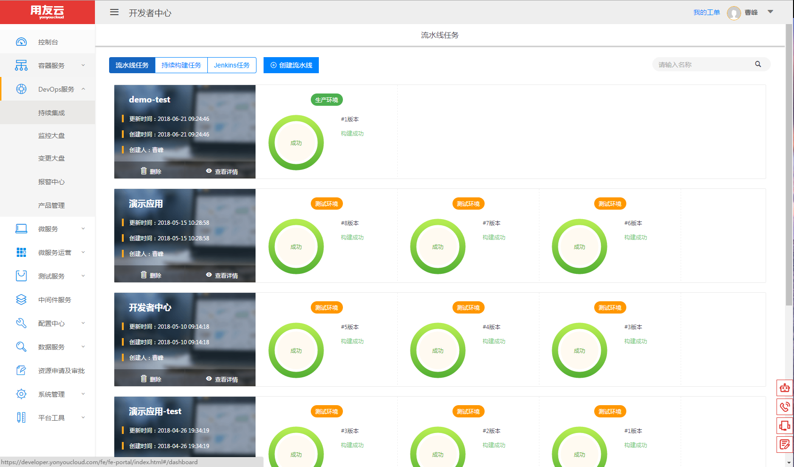
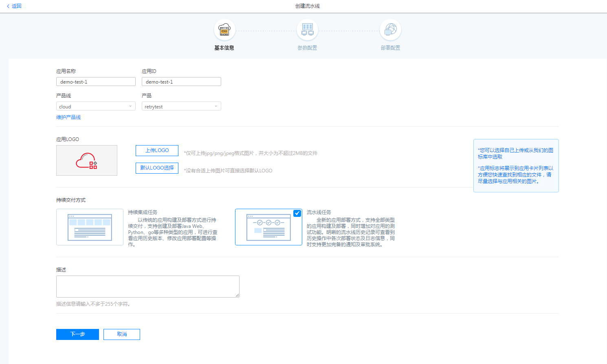
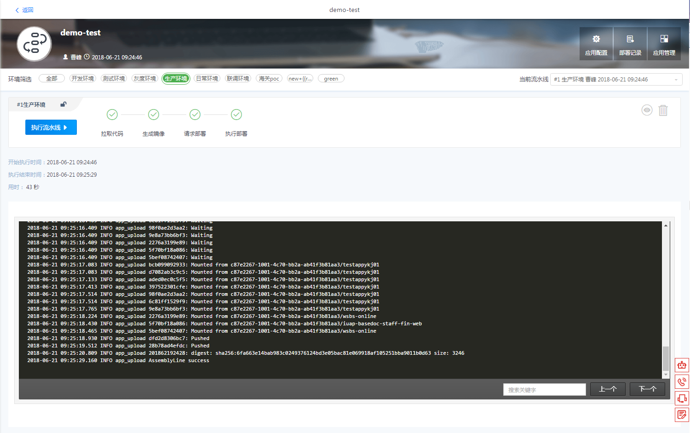
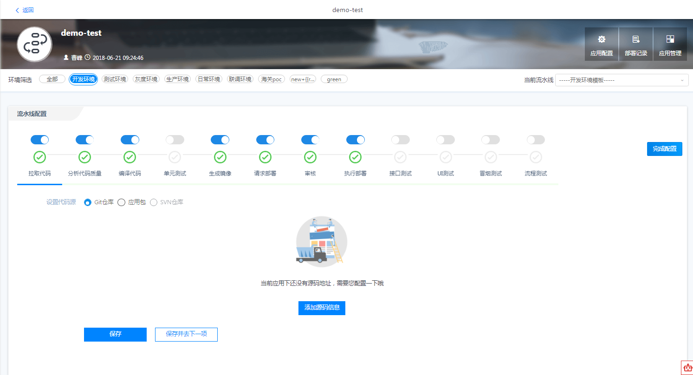
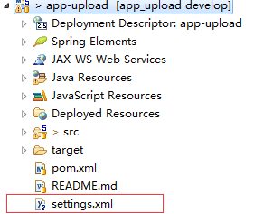
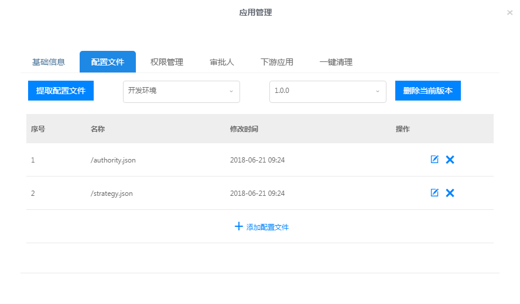
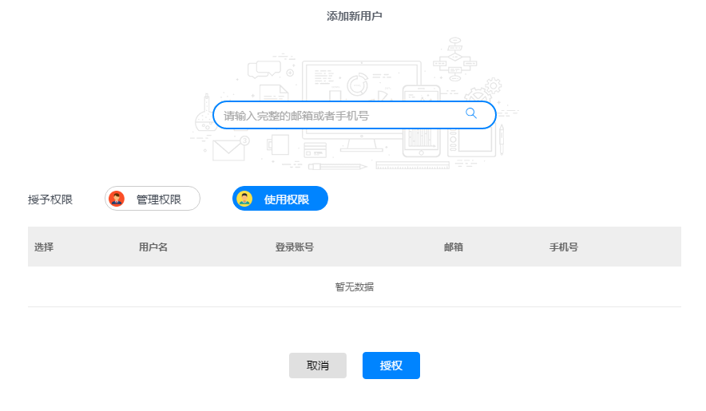
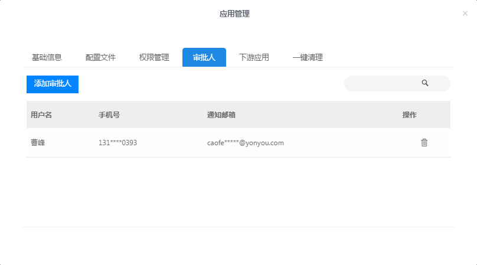
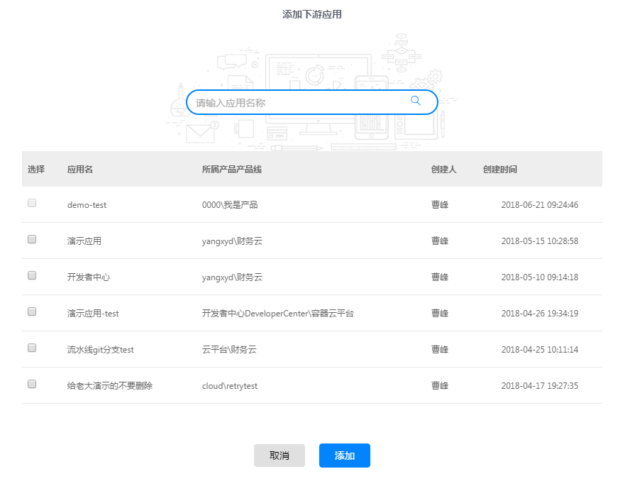
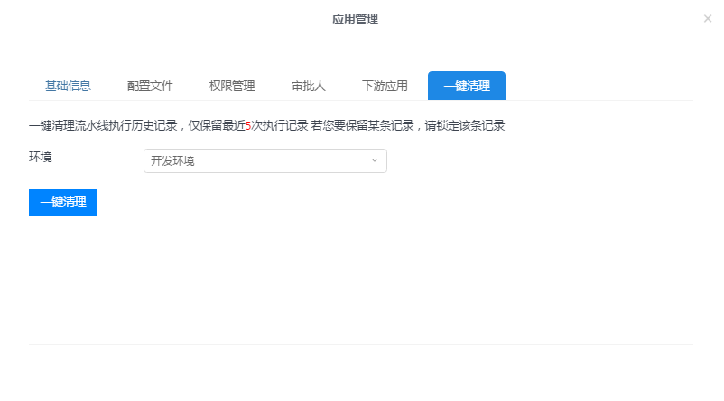

# 概述
用友云开发者中心提供了应用持续集成，针对各种项目类型的应用进行快速迭代开发的持续集成功能。

  
## 持续集成入口 ##

登录开发者中心，在左侧导航栏中进入持续集成，默认展示当前用户下应用构建任务列表，应用最新的构建状态等信息将在此展示出来。如图1-1所示。  

图 1-1 

注：可以点击部署按钮，直接部署最新构建任务。
             
## 创建新应用 ##

点击创建新应用进入创建新应用页面，编辑所需要构建应用表单，为后续部署做前期准备。如图1-2所示。

图 1-2 

部分功能描述如下：

### 1.上传描述文件 ###

可以点击下载示例描述文件，修改示例文件内容后上传及可把创建新应用表单自动填充，实现一键填充功能。

	---
	appName: 测试应用
	version: v1
	environment: dev
	modules:
	- module_name: UPLOAD_MODULE
	  content:
	    baseImage: tomcat:6.0.48-jre8-alpine
	    imageName: testimage
	    is_root_path_access: true
	    appType: java
	- module_name: CONFCENTER_MODULE
	  content:
	    appCode: 0.0.1
	    description: This is a test app for one key deploy
	    emails: developercenter@yonyou.com,devops@yonyou.com,superman@yonyou.com
	    conf_files:
	    - configuration.xml
	    - "/content/application.properties"
	- module_name: PUBLISH_MODULE
	  content:
	    app_name: self_design_publish_name
	    port_settings:
	    - port: 8080
	      protocol: TCP
	      access_mode: HTTP
	      access_range: OUTER
	    source_pool_id: 1
	    source_pool_name: 体验资源池1
	    basic_setting:
	      cpu: 0.15
	      memory: 512
	      disk: 1024
	      instances: 3

### 2.应用分类 ###

现支持Java应用、Nodejs应用、静态网站、Python应用、go应用。

### 3.基础环境 ###

基础环境会根据应用分类提供当前最新的环境选择。

## 应用构建任务详情 ##

点击持续集成中的构建任务列表，进入应用构建任务详情列表。如下图1-3。

图 1-3

部分功能描述如下：

### 1.应用多版本构建 ###

可以点击上传按钮实现多版本构建，使迭代开发更加便捷。

### 2.配置文件 ###

现针对Java应用可提取项目内的配置文件，提取项目内配置文件路径（WEB-INF/classes）。

上传一个带有配置文件的项目后，点击提取配置文件。如下图1-4。

图 1-4

点击提取配置文件，勾选所需要提取的配置。如下图1-5。

图 1-5

点击提取按钮，将在提取文件页签下显示出所提取的配置文件。如下图1-6。

图 1-6

可在线编辑所提取的配置文件。如下图1-7。

图 1-7

注：所提取得配置文件也可以到配置中心去进行相关操作。左侧导航栏配置中心-->配置管理
选择应用上传时的应用编码、环境、版本（提取配置时所填写的版本）查询。如下图1-8。

图 1-8

### 3.部署 ###

选中所需要部署的构建版本后，点击右上角的部署按钮，及跳转到部署页面，进行应用的部署操作。如下图1-9。

图 1-9

跳转到部署页面。如下图1-10。

图 1-10

## 流水线入口 ##
登录开发者中心，在左侧导航栏中进入持续集成，默认展示当前用户下应用流水线任务列表，流水线最新的构建状态等信息将在此展示出来。如图1-11所示。

图 1-11
 

## 创建流水线 ##

点击创建流水线进入创建新应用页面，编辑所需要构建应用表单，为后续部署做前期准备。如图1-12所示。

图 1-12 

部分功能描述如下：

### 1.流水线详情页 ###

点击流水线列表视图进入流水线详情页面，此页面详细的描述流水线上执行步骤及日志信息等执行情况。如图1-13所示。

图 1-13 

### 2.流水线编辑 ###

点击流水线详情页中编辑按钮进入流水线编辑页面，此页面可以设置流水线所需要执行的模块及构建信息。如图1-14 1-15所示。

图 1-14 

图 1-15 

### 3.流水线中java类型应用 支持自定义settings ###

使用此功能需要把settings文件放到根目录下，如果有此文件默认优先级使用项目内的settings。如图1-16所示。

图 1-16 

### 4.应用管理 ###

此功能包含：基础信息、配置管理、权限管理、审批人、下游应用、一键清除等功能。

#### 4.1基础信息 ####

流水线基础信息展示。如图1-17所示。

图 1-17 

#### 4.2配置管理 ####

支持文件提取到配置中心，可以进行文件的修改删除等操作。如图1-18所示。

图 1-18 

#### 4.3权限管理 ####

流水线权限管理功能，分配流水线权限（管理权限、使用权限）。如图1-19所示。

图 1-19 

#### 4.4审批人 ####

流水线中有审批环节，此功能可以维护审批人。如图1-20所示。

图 1-20 

#### 4.4下游应用 ####

可以为应用添加下游应用，如果此应用构建同时会发送邮件告诉下游应用的创建人。如图1-21所示。

图 1-21 

#### 4.5一键清除 ####

支持环境一键清除会保留最近的5条记录。如图1-22所示。

图 1-22 

### 5.部署记录 ###

显示此流水线中个环境所有的部署记录。如图1-23所示。

图 1-23 

### 6.应用管理 ###

选中构建成功的版本后点击应用管理，跳转到应用管理详情页面。如图1-24所示。

图 1-24 

